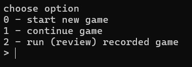
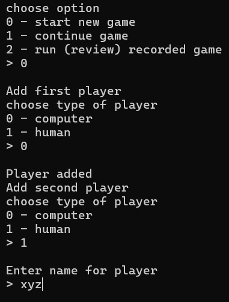
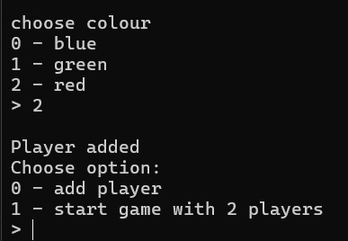
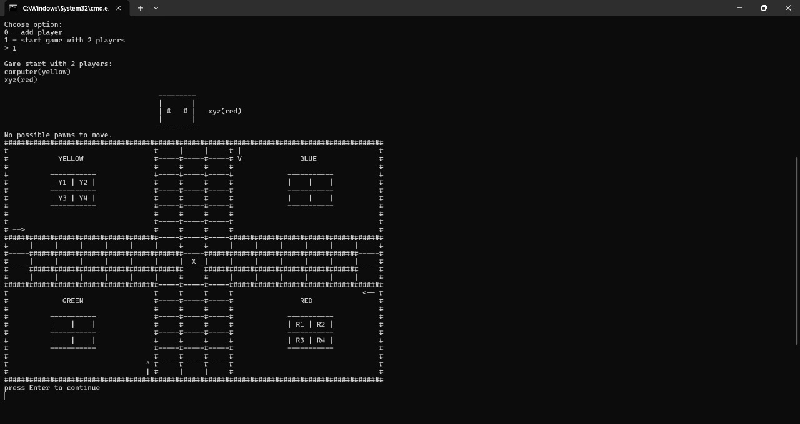

## 🧩 Ludo Game in Python

Welcome to the **Ludo Game** – a Python-based recreation of the classic board game loved by all ages. This game offers a GUI-based, turn-based multiplayer experience where up to 4 players can enjoy a full Ludo match locally.

---

### 🎮 Demo Previews

Here are some screenshots from the game:

|   |  |
| -------------------- | -------------------- |
|  |  |

---

### 🚀 Features

* 🎲 Fully playable 4-player Ludo board
* 🧠 Turn-based logic with dice roll animations
* 🟢 Graphical User Interface using `tkinter`
* 🧮 Automatic movement and kill logic
* 🏁 Win tracking and game end logic

---

### 📁 Project Structure

```
ludo-python/
├── assets/              # (Optional) Game images, icons
├── demo.jpg             # Demo screenshots
├── demo1.jpg
├── demo2.jpg
├── demo3.jpg
├── run.py              # Main game file
└── README.md            # This file
```

---

### 💻 How to Run

1. Make sure you have Python 3 installed.
2. Install dependencies (if any):

   ```bash
   pip install -r requirements.txt
   ```
3. Run the game:

   ```bash
   python main.py
   ```

> ⚠️ **Note**: This game is designed for local multiplayer. No AI or network play is included.

---

### 🛠️ Built With

* Python 3
* `tkinter` for GUI
* `random` for dice mechanics

---

### 📜 License

This project is licensed under the MIT License - see the [LICENSE](#license) section below for details.

```
MIT License

Copyright (c) 2025 Gourab

Permission is hereby granted, free of charge, to any person obtaining a copy
of this software and associated documentation files (the “Software”), to deal
in the Software without restriction, including without limitation the rights
to use, copy, modify, merge, publish, distribute, sublicense, and/or sell
copies of the Software, and to permit persons to whom the Software is
furnished to do so, subject to the following conditions:

The above copyright notice and this permission notice shall be included in
all copies or substantial portions of the Software.

THE SOFTWARE IS PROVIDED “AS IS”, WITHOUT WARRANTY OF ANY KIND, EXPRESS OR
IMPLIED, INCLUDING BUT NOT LIMITED TO THE WARRANTIES OF MERCHANTABILITY,
FITNESS FOR A PARTICULAR PURPOSE AND NONINFRINGEMENT. IN NO EVENT SHALL THE
AUTHORS OR COPYRIGHT HOLDERS BE LIABLE FOR ANY CLAIM, DAMAGES OR OTHER
LIABILITY, WHETHER IN AN ACTION OF CONTRACT, TORT OR OTHERWISE, ARISING FROM,
OUT OF OR IN CONNECTION WITH THE SOFTWARE OR THE USE OR OTHER DEALINGS IN THE
SOFTWARE.
```

---

### 🙌 Contribution

Pull requests are welcome! For major changes, please open an issue first to discuss what you'd like to change.

---
